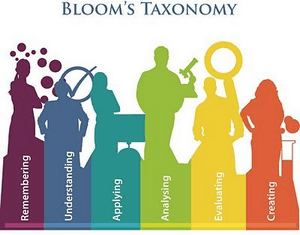

Learning Outcomes for the class  include:

1. *Understand* the fundamental fluid mechanics and conservation laws governing hydraulic processes in natural river channels, and be able to *read, map and interpret* hydarulic paterns in rivers or from hydraulic models..
2. 
4. Have a working understanding of the primary types of ecohydraulic habitat models and how to run them for specific species at specific lifestages.

---
Note: The words in *italics* above refer to specific types of learning objectives (cesnu [Bloom's Taxonomy](https://cft.vanderbilt.edu/guides-sub-pages/blooms-taxonomy/)), whereas the **bold** words describe the specific topics students will be developing those skills with respect to. 
